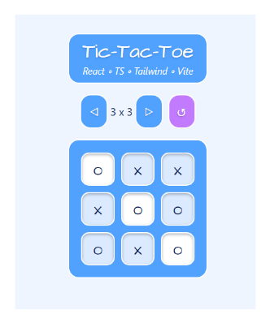

# Tic-Tac-Toe

A simple game, made with React, TypeScript and Tailwind, using Vite for a school assignment in my second semester of pursuing my new skill set as a webdev 🤓 

|   |   |
|---|---|
|   |  [Try it out! 🎮](https://linneatoth.github.io/TicTacToe/)|

## Features
- Turned-based progress, alternating between X and O
- App checks for winner on diagonal, horizontal and vertical rows after every turn
- Winning row gets visual feedback
- Game is locked on draw or win
- Reset function
- Allows user to change the board size dynamically

## Tech
- **Frontend:** React, TypeScript, Tailwind  
- **Build tool:** Vite  
- **Deployment:** GitHub Pages  

## Takeaways
Okay, I love TypeScript. There, I said it. I will set out to master utility types and really get the hang of implementation in terms of React development, but so far it is a love story. Nothing less 💙
While doing this assignment, I studied and somewhat grasped the useReducer hook. In hindsight it would have been a great fit here. Next time!

# The assignment - translated from Swedish, for your convenience:
> ## About the assignment  
> In this assignment, you will create a small project to demonstrate that you can use TypeScript in React.  
>  
> ## Case  
>  
> ## What you should do  
> You will build a simple Tic-Tac-Toe game that runs in the browser.  
>  
> The requirements are:  
>  
> - [ ] There must be a game board with 3x3 squares  
> - [ ] There must be a button to start or restart the game  
> - [ ] When the first click occurs in a square, an X is placed; on the next click, an O is placed, and so on  
> - [ ] The entire project must be written in TypeScript using React  
>  
> Example solution in Vanilla JS for reference:  
> https://codepen.io/Tobias-Land-n/pen/JjVZwJv  
>  
> Note: the example also contains parts of the extra challenge.  
>  
> If you have time and want to, try to add the following:  
>  
> - The user should be able to set the size of the board  
> - The user should be able to decide how many Xs or Os in a row are needed to win  
> - The game should automatically determine who has won  
